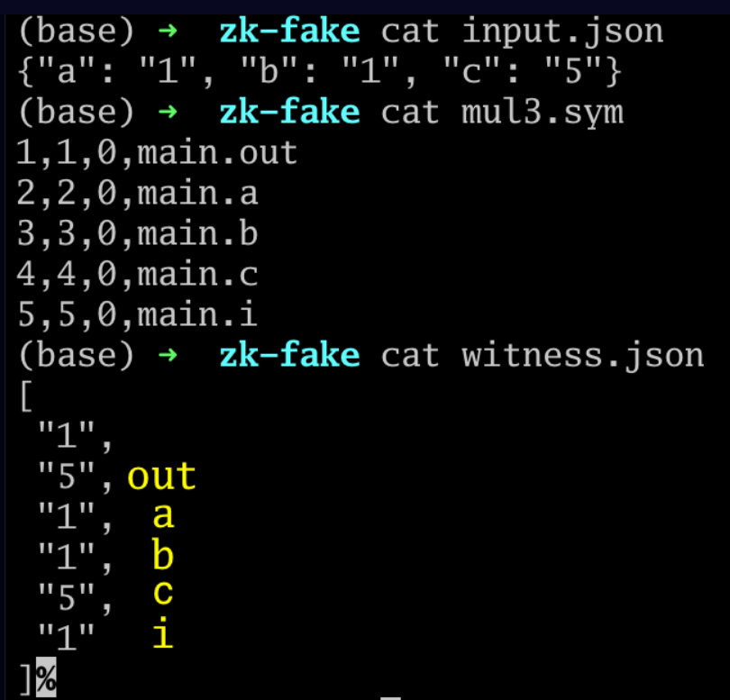
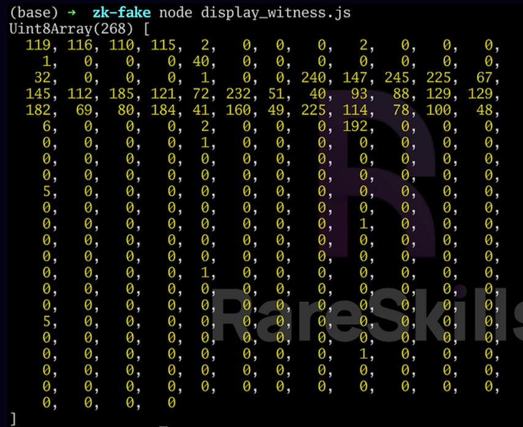
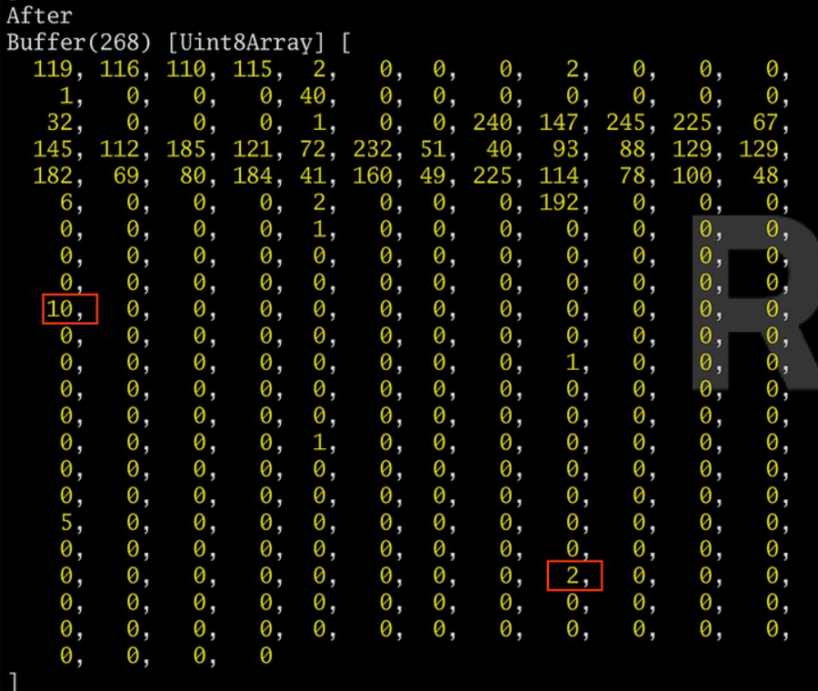

| date       |                                                |
| ---------- | ---------------------------------------------- |
| 2024-12-25 | MIT ZKP前两节, 然后看circom, Tornado, R1CS教学 |
|            |                                                |
|            |                                                |
|            |                                                |
|            |                                                |
|            |                                                |
|            |                                                |


## 2024-12-25

> ```js
> // 计算lin的二进制表示
> template BinSum(n, ops) {
>     signal input lin;
>     var nout = nbits(lin); // 计算lin需要几位二进制表示
>     signal output out[nout];
> 
>     var lout = 0;
> 
>     var k;
>     for (k=0; k<nout; k++) {
>         out[k] <-- (lin >> k) & 1;
> 
>         // Ensure out is binary
>         out[k] * (out[k] - 1) === 0;
>         
>         lout += out[k] * 2**k;
>     }
>     // Ensure the sum
>     lin === lout;
> }
> ```
>
> 在for循环中, 为什么要有
>
>         // Ensure out is binary
>         out[k] * (out[k] - 1) === 0;
>         lout += out[k] * 2**k;
>
> 呢, 难道out[k] <-- (lin >> k) & 1; 会返回0, 1以外的结果吗? out每位求和会不等于lin吗? 我感觉有点多此一举啊, 如果我写一个c++代码计算ops个n位operands之和的二进制表示, 肯定不会写这些代码的啊

解释: 可能对于verifier来说只看得到<=\=和==\=的约束, 看不到约束之外的代码逻辑 (是这样吗?), 所以在写约束时不能考虑之前的代码的逻辑, 而必须从verifier的角度考虑, “我必须看到xx和xx约束, 才能相信这个证明确实有我想要的效果”. 但是如果verifier看不到lout是怎么来的, 那约束`lin === lout;`不就失去意义了吗?

> 比如我给定lin = 7, out应该等于[1, 1, 1], 那如果没有这些验证代码, prover在什么时候可以将out伪造为[3, 0, 1]呢?
>
> circom中, <--与传统语言 (比如c++) 中的赋值符号有区别吗? 如果没有, <\==符号不就没有意义了吗, 因为<--一定能确保符号左右两边相等, 那为什么还要===来约束这一事实呢? 我不理解在<--后立刻=\== (也就是<\==分解后的两步) 有什么意义. 我的感觉就像是一种莫名其妙的规定, 二次以内的计算要用<=\=, 非二次以内的计算可以用<--. 但全用<--会有什么后果吗?
>
> 同样的问题:
>
> ```js
> pragma circom 2.1.6;
> 
> template Powers() {
>     signal input a;
>     signal output powers[4];
>    
>     powers[0] <== a;
>     powers[1] <== a * a;
>     powers[2] <-- a ** 3;
>     powers[3] <-- a ** 4;
>     
>     powers[0] + powers[1] + powers[2] === powers[3] - a;
> }
> component main = Powers();
> /*
> INPUT = { "a": "2" }
> */
> ```
>
> 有两个没有用<\==, 我想提供虚假的证明, 可以怎么做呢


> circom:
>
> ```js
> pragma circom 2.1.6;
> 
> template Powers() {
>     signal input a;
>     signal output powers[6];
>    
>     powers[0] <== 2 * a;
>     powers[1] <== 3 * a;
>     powers[2] <== 4 * a;
>     powers[3] <== powers[2] * a;
>     powers[4] <== powers[3] * a;
>     powers[5] <== powers[4] * a;
>     
> }
> component main = Powers();
> /*
> INPUT = { "a": "2" }
> */
> ```
>
> zkrepl输出:
>
> ```
> stdout: 
> template instances: 1
> non-linear constraints: 3
> linear constraints: 2
> public inputs: 0
> public outputs: 6
> private inputs: 1
> private outputs: 0
> wires: 7
> labels: 8
> Written successfully: ./main.r1cs
> Written successfully: ./main.sym
> Written successfully: ./main_js/main.wasm
> Everything went okay, circom safe
> Compiled in 0.82s
> ```
>
> 终端circom输出:
>
> ```bash
> wanghao@kitakita:~/Coding/ETH_exercise/Ex6/factor$ circom test.circom --r1cs
> template instances: 1
> non-linear constraints: 3
> linear constraints: 3
> public inputs: 0
> private inputs: 1
> public outputs: 6
> wires: 8
> labels: 8
> Written successfully: ./test.r1cs
> Everything went okay
> ```
>
> 好奇怪...线性约束一个是3一个是2 (wires也不一样).
>
> 另一个例子:
>
> ```js
> pragma circom 2.1.6;
> 
> template Powers() {
>     signal input a;
>     signal output powers[6];
>    
>     powers[0] <== a * 2;
>     powers[1] <== a * a;
>     powers[2] <-- a ** 3;
>     powers[3] <-- a ** 4;
>     powers[4] <-- a ** 5;
>     powers[5] <-- a ** 6;
>     
> }
> component main = Powers();
> /*
> INPUT = { "a": "2" }
> */
> ```
>
> zkrepl的线性约束是0, circom是1, 所以感觉应该是编译器优化问题? 一个认为a*2算约束一个认为不算.

是的, 就是optimizer的缘故了, optimizer会忽略<==, =\==下的non-quadratic constraints (也就是非signal*signal). 可以使用如下命令禁止忽略约束:

```bash
circom <FILE_NAME>.circom --r1cs --O0
```


> 经典的[IsZero电路](https://github.com/iden3/circomlib/blob/master/circuits/comparators.circom#L24-L34): 如果in为0则out为1, 如果in不为0则out为0.
>
> ```js
> template IsZero() {
>   signal input in;
>   signal output out;
> 
>   signal inv;
> 
>   inv <-- in!=0 ? 1/in : 0;
> 
>   out <== -in*inv +1;
>   in*out === 0;
>   
>   //out*(out-1) === 0;
> }
> ```
>
> 感觉删除`in*out === 0;`也不会破坏程序逻辑.
>
> 助教的解释是: 对于verifier来说inv怎么得到是未知的, 所以`out <== -in*inv + 1`在verifier的视角下并不能保证一定是0或1. 那这样不是加一条`out*(out-1) === 0;`就能解决问题了吗?
>
> 更进一步, 究竟在数学上怎样证明一个ZKP算法的“完备性”呢? 使用约束可以接近ZKP的完备性, 但是多少约束, 什么样的约束才能让verifier同意“这个ZKP一定是对的”呢?

我理解了! 首先要理解circom和solidity的关系 ([为什么要用circom生成solidity语言而不直接写solidity语言](https://ethereum.stackexchange.com/a/163860/149230)), circom的主要作用是一个给prover在链下从signal inputs开始计算的工具 (signal input-\->circom-\->intermediate signal, signal output), 次要作用是生成一个链上的verifier代码. prover部分的工作计算量很大不可能在链上完成. 比如我要证明我的tx hash在Tornado的Merkle Tree上, 我就需要大量的哈希计算, 这部分是在circom (也就是offline) 完成的, 完成后把proof (所谓proof实际上就是包含所有signal的json) 提交给verifier, 也即solidity代码, solidity在链上验证all signals符合all constrains.

回到这个问题, verifier只看得到prover提交的proof和constrains, 因此如果删掉`in*out === 0;`那prover就可以提交如下proof:

-   in = 1
-   inv = -1
-   out = 2

这份proof显然不是用circom计算出来的, 但这并不影响它被提交, 且也能通过constrains, 因此constrains并没有保证该证明的完备性. 至于是否要添加`out*(out-1) === 0;`, 以及它和`in*out === 0;`相比约束力如何, 可能并没有mathematically的判断方法, 可能只能在只看constrains的情况下尝试所有可能的输入确保不会有破坏证明的“合法”输入. 一个经验原则是每添加一个中间信号signal就需要多一个约束.

如何hacking: [Hacking Underconstrained Circom Circuits With Fake Proofs](https://www.rareskills.io/post/underconstrained-circom)

-   对于`mul3.circom`, 先写`input.json`包含所有signal input

    ```json
    {"a": "1", "b": "1", "c": "5"}
    ```

    然后运行

    ```
    circom mul3.circom --r1cs --wasm --sym
    ```

    生成.rics约束文件, WebAssembly (包含电路的计算逻辑的文件, 用来生成witness), .sym (符号表, 记录电路的信号名称和编号)

    然后运行

    ```
    cd mul3_js/
    node generate_witness.js mul3.wasm ../input.json ../witness.wtns
    cd ..
    ```

    生成合法的`witness.wtns`, 一个二进制文件

    可以转换为json格式, 并且用.sym对应signal的值

    ```
    snarkjs wtns export json witness.wtns witness.json
    ```

    

    验证witness的合法性:

    ```
    snarkjs wtns check mul3.r1cs witness.wtns
    ```

-   恶意篡改`.wtns`:

    二进制文件无法被直接编辑, 但我们可以查看[生成`.wtns`的代码](https://github.com/iden3/circom_runtime/blob/master/build/main.cjs#L533)知道它是怎样被编码的, 然后写代码将二进制转换为bytes

    ```js
    const fs = require('fs');
    
    const filePath = 'witness.wtns';
    
    const data = fs.readFileSync(filePath);
    
    let data_arr = new Uint8Array(data);
    console.dir(data_arr, {'maxArrayLength': null});
    ```

    

    找到对应的index (如何找就还得去读生成`.wtns`的源代码), 修改数组内容

    ```js
    const fs = require('fs');
    
    const filePath = 'witness.wtns';
    
    const data = fs.readFileSync(filePath);
    
    data[108] = 10; // `out`
    data[236] = 2;  // `i`
    
    console.log("After");
    console.dir(data, {'maxArrayLength': null});
    
    fs.writeFileSync('exploit_witness.wtns', data);
    ```

    

    然后用篡改的`.wtns`通过`.rics`验证:

    ```
    snarkjs wtns check mul3.r1cs exploit_witness.wtns
    ```


> ```js
> pragma circom 2.1.6;
> 
> include "node_modules/circomlib/circuits/comparators.circom";
> 
> template IfThenElse() {
>     signal input condition;
>     signal input true_value;
>     signal input false_value;
>     signal output out;
> 
>     // TODO
>     // Hint: You will need a helper signal...
>     0 === condition * (1 - condition);
>     signal helper1;
>     // signal helper2;
>     
>     helper1 <== true_value * condition;
>     // helper2 <== false_value * (1 - condition);
>     
>     out <== helper1 + false_value * (1 - condition);
> 
> }
> 
> component main = IfThenElse();
> /*
> INPUT = { 
>     "condition": "1",
>     "true_value": "1",
>     "false_value": 0
> }
> */
> ```
>
> 这么写可以通过, 但是
>
> ```js
> pragma circom 2.1.6;
> 
> include "node_modules/circomlib/circuits/comparators.circom";
> 
> template IfThenElse() {
>     signal input condition;
>     signal input true_value;
>     signal input false_value;
>     signal output out;
> 
>     // TODO
>     // Hint: You will need a helper signal...
>     0 === condition * (1 - condition);
>     signal helper1;
>     // signal helper2;
>     
>     helper1 <== true_value * condition;
>     // helper2 <== false_value * (1 - condition);
>     
>     out <== true_value * condition + false_value * (1 - condition);
> 
> }
> 
> component main = IfThenElse();
> /*
> INPUT = { 
>     "condition": "1",
>     "true_value": "1",
>     "false_value": 0
> }
> */
> 
> ```
>
> 就报错:
> stderr: 
> error[T3001]: Non quadratic constraints are not allowed!
>    ┌─ "main.circom":20:5
>    │
> 20 │     out <== true_value * condition + false_value * (1 - condition);
>    │     ^^^^^^^^^^^^^^^^^^^^^^^^^^^^^^^^^^^^^^^^^^^^^^^^^^^^^^^^^^^^^^ found here
>    │
>    = call trace:
>      ->IfThenElse
>
> previous errors were found
>
> 这是为什么? 什么是quadratic constraints的定义?


> Tornado的平方数?