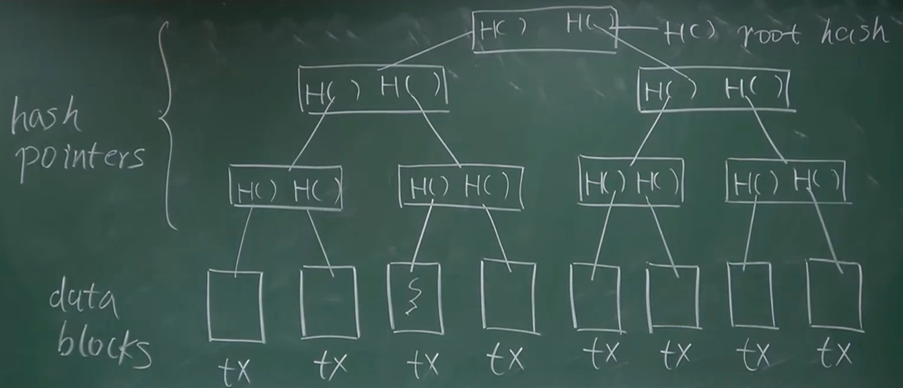
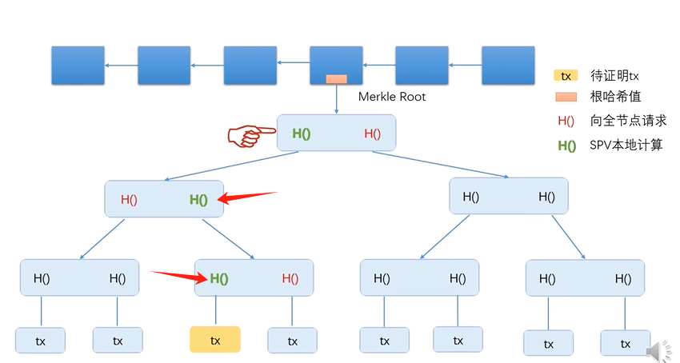

## BTC

### 密码学原理

cryptographic hash function 比特币的哈希函数 (SHA-256) 性质:

-   collision resistance:

    collision 哈希碰撞, 也就是对哈希函数$H$, 输入$x\ne y$, 但发生$H(x) = H(y)$

    collision resistance不是指不会发生哈希碰撞 (因为输出空间是有限的, 比如256位哈希那output只有$2^{256}$, 但输入空间是无限的), 而是指只能用暴力的方式才能得到哈希碰撞. collision resistance的意义是对于输入的message, SHA256输出digest, 那如果message被篡改, digest一定是不一样的.

    注意, SHA256的collision resistance性质并不能从数学上被证明, 只是经验上过了这么久也没人找到SHA256的碰撞方法, 所以认为它是collision resistance的. 历史上也有曾经被认为是collision resistance的哈希函数, 后来被找到碰撞方法, 比如MD5. 所以SHA256也可能会被找到哈希碰撞算法...比特币崩塌的那一天?

-   hiding:

    从input x得到output H(x), 但不能反过来, 后者没有透露前者的任何信息

    collision resistance和hiding可以实现等效的数字信封 / 数字承诺: 将信息X和随机数nonce输入哈希函数: H(X||nonce), 将这个哈希值公布出去, 由于hiding性质, 不会透露X的内容; 由于collision resistance的性质, X无法被修改, 此时H(X||nonce)就相当于将X放进第三方的信封且不能再被修改, 之后可以由这个第三方 (也就是哈希函数) 来验证信息内容.

-   puzzle friendly

    对于输入x, 哈希值H(x)长什么样是不可预测的, 比如我想得到前k位为0, 剩下256-k位不为0的哈希值, 那只能通过暴力的方法尝试x

    利用这个性质完成比特币挖矿过程: 在block header中有个nonce随机数, 通过暴力计算找到某一个nonce使得H(block header) <= target成立, 其中target是2^256中的很小一部分, 比如2^64

    需要通过大量运算才能找到nonce, 但在找到后向其他区块发布, 其他区块很容易验证

比特币的账户签名:

非对称加密算法: (public key, private key), A把btc发给B, 过程大致如下:

1.   A用自己的私钥进行签名, 发送交易信息, 交易信息包含: A的公钥, B的公钥, 交易金额和输入输出数据
2.   广播交易, 其他节点用A的公钥验证A的私钥签名是否有效
3.   B用自己的私钥控制btc, 并且B的地址 (公钥哈希) 作为这些btc的接收者被记录在区块链上

>   发起转账的签名过程是用私钥+什么函数完成的? 为什么可以用A的公钥确认一个由A的私钥构建的签名?
>
>   答: 签名过程大概就是用私钥+椭圆曲线生成一组$(r,s)$, 这就是签名. 这个算法的性质就是可以由公钥$K$验证签名来自私钥$k$ (而不需要知道$k$), 以后可以再看看数学上的证明...

生成公钥/私钥对和转账时的签名信息都需要好的随机源, 如果随机源不好, 那有可能两个人生成同样的公钥/私钥对, 就可以用私钥转走别人的钱包, 或是在签名时泄露私钥. 但目前还没发生过

>   这一部分的随机数碰撞感觉还挺有意思的, 碰撞发生的概率怎么算?

### 数据结构

哈希指针: 同时记录了“内容的地址 + 内容所在的结构体的哈希值”, 比普通指针多记录一个哈希值, 能知道内容所在的数据结构体有没有被篡改

区块链 = 用哈希指针连接的链表

区块链结构:

genesis block <- block (Hash Pointer) <- block (Hash Pointer) <- ... <- block (Hash Pointer) <- most recent block (Hash Pointer) <- Hash Pointer

每一个区块都有一个哈希指针, 它记录前一个区块整体的哈希值. 想象一下如果block i被修改, 那么block i+1的哈希指针会被修改, 那么block i+2的哈希指针也被修改...直到最近区块的哈希指针也会被修改, 也就是说区块链中的某个区块内容发生变化, 那其之后的所有区块内容都会发生变化

这样的结构使得我不需要保存所有区块的数据, 我可以只保存block i到most recent block, 这样当我想要获得block i之前的区块信息时, 就向别人请求block i-1, 并将block i-1的哈希值与block i中的哈希指针对比来验证block i-1的正确性.

Merkle Tree

与binary tree的区别: 用哈希指针代替了普通指针

最下面是数据块, 上面的都是哈希指针, 每个H()存的都是它指向的结构体的哈希值. 最上面那个节点也需要取哈希值, 称为root hash. 这种数据结构的好处是只要记录root hash就能验证整棵树的所有内容没有被修改.

在真实的btc结构中每个区块是一棵Merkle Tree, 叶节点存的是该区块记录的所有转账交易 (tx)

轻节点: 只有block header, 只有root hash值

全节点: 有block header和block body的节点, 存了整棵Merkle Tree

轻节点怎样验证某笔tx是否被区块记录了呢? 过程如下:

转账方发送待验证tx和所有红色的哈希值, 轻节点就可以依次计算出所有绿色的哈希值, 直到得到根哈希值, 如果根哈希值与轻节点中记录的一样那就证明这笔tx确实被记录到了区块中. 这个验证过程叫做Merkle Proof.

转账方无法让轻节点相信一笔不在区块链上的交易: 因为SHA256无法进行哈希碰撞, 转账方没有办法通过修改红色的哈希值使得最终的根哈希值与轻节点中记录的相同. 

假设有Merkle Tree中有n笔tx, 轻节点验证一笔tx在某个区块中的复杂度是$\theta(\log n)$, 因为一共有$\log_2 n$层; 

为了能够让轻节点快速验证“一笔tx不在某个区块中”, 我们会事先对每笔tx的H()按大小排序 (Sorted Merkle Tree), 对于要被验证的tx, 我们计算它的H(), 它会落在某两个合法的H()之间, 然后对这两个H()做Merkle Tree, 如果得到的根哈希值和轻节点中的相同, 则证明新tx不是该区块的交易. 

原因: 从两个H()可以成功得到根哈希值, 证明Merkle Tree没问题, 而新tx的H()又不在树中, 就证明了tx不属于某区块.

### 协议

一个btc区块的组成部分:

-   block header:
    -   btc协议版本, 4字节
    -   指向前一个block header的hash pointer, 32字节
    -   Merkle Tree 根哈希值, 32字节
    -   时间戳, 4字节
    -   难度目标 Bits, 4字节
    -   随机数nonce (number used only once), 4字节
    
    挖矿就是通过调整nonce和timestamp使得hash(block header) <= Target, 其中Target = Bits前三个字节 \* 2^8*(第四个字节-3)^
    
    Merkle Tree的根哈希值在挖矿过程中也是可以调整的, 因为每个区块的Merkle Tree的第一笔交易是coinbase交易, 它有一个CoinBase域, 可以写任何内容, 调整内容就会改变coinbase tx的hash, 进而改变Merkle Tree根哈希值, 因此指定CoinBase前8个字节的空间作为extra nonce, nonce就有2^96^空间了.
    
    另外区块被挖出后Bits和nonce就不会改变了.
    
-   block body: 用Merkle Tree记录所有的tx. hash pointer连接的只是block header, block body不参与挖矿和hash的计算.

btc作为分布式账本就要有共识协议, 来决定包含哪些交易的区块是合法区块, 可以加入到区块链中. 共识协议:

-   投票机制, 每个地址节点都有投票权, 来决定哪些交易是合法的. 导致的结果: 恶意用户可以生成占总地址数一半以上的地址, 操纵投票结果.

    因此, btc采用算力来保证共识账本的安全. 挖矿->找到合法的nonce, 获得coinbase奖励->拥有这个区块的记账权. 合法区块共同维护一个区块链中的最长链.

### 实现

BTC账本并不记录“每个账户有多少BTC” (ETH是这么做的), 而是记录所有转账信息, 通过历史转账信息计算新的转账是否合法. BTC协议维护UTXO (Unspent Transaction Output), 记录所有转账后还未花出的btc, 比如A->B 5btc, 那就在UTXO中删去A的5个btc并添加B有5个未花的btc. 

>   感觉UTXO的记录方式和直接记录每个地址有多少btc也没区别啊
