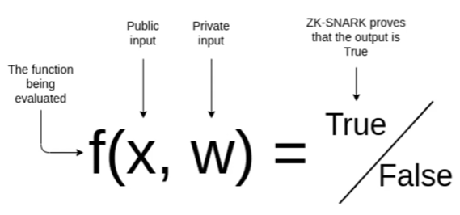
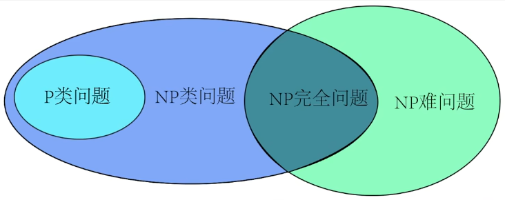
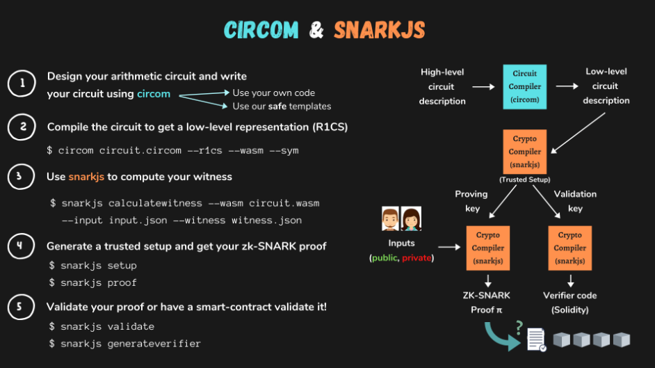

## Lecture 1: Intro to ZK

ZK协议性质:

-   Zero Knowledge: Prover回答不提供信息
-   Completeness: Prover如果知道真实的信息, 他们总能答对
-   Soundess: 如果Prover实际上不知道真实的信息, 他们最后一定会出错

ZKP的现状: 每个ZPK问题都需要一个特定的协议, 因此, 

ZKP的目标: 找到一种“圣杯”协议, 能够在所有情况下满足: 对于任意的输出$y$和函数$f$, 我知道存在$x$使得$f(x) = y$, 我能证明这一点但又不泄露$x$的信息.


匿名投票问题:

假设有3个合法的投票者 (prover), 私钥公钥为(sk1, pk1), (sk2, pk2), (sk3, pk3), verifier要验证他们投票的合法性但是又不能知道他们的真实身份 (不能知道这个公钥是pk1, pk2 or pk3), 可以设计一个以下协议:

在prover给出投票结果的同时, 给出私钥, verifier用以下函数验证:

-   pubkeygen(sk) = pk
-   (pk-pk1)(pk-pk2)(pk-pk3) = 0
-   hash(sk) = nf

前两行验证了投票者的合法性, 第三行通过添加nullifier保证了同一个sk无法多次投票.

问题: prover能不能在hash(sk)的部分将sk换为随机值以伪造nullifier?

-   不行, 因为这个协议的要求就是prover只能提供一个输入

>   问题: verifier到底能看到哪些东西呢? 如果能看到的是所有等式右边的东西那第一行就泄露了投票者的pk, 所以这个协议应该还规定了: verifier只能看到 prover的投票结果+第二第三行等式右边的内容. prover的pk仍然在这个过程中被计算出来了, 虽然可能协议规定会销毁它, 但总令人有点不安...


zkSNARKs: 一套生成ZKP协议的普遍标准 / 流程

-   zk: input是隐藏的
-   succinct: prover提供的证明可以被快速验证, 一般是常数时间或对数时间
-   noninteractive: 协议只需要一次消息就能验证 (不像三色问题的ZKP需要需要back-and-forth而且最后也没法保证100%的概率)
-   argument of knowledge: prover除了提供证明的正确陈述外, 能证明自己知道input



zkSNARKs的运作过程:

-   是将问题转换为函数, 函数不会暴露inputs, 且指定了输出y
-   将函数转化为R1CS (Rank-1 Constraint System)形式, 大概就是转化为只有加法与乘法的算数电路
-   生成满足该R1CS的ZKP

一个例子, 将`f(x) = (x1+x2)*x3-x4` zkSNARKs化, 也就是说prover要提供一组(x1, x2, x3, x4), 使得f(x1, x2, x3, x4) = out, out就是verifier要验证的结果:

首先是将其按照人类思维将f(x)的计算分步 (有点像汇编语言计算的分步):

Function Inputs: x1, x2, x3, x4

```
y1 := x1 + x2
y2 := y1 * x3
OUT := y2 - x4
```

然后写成SNARK协议中prover的输入输出形式:

SNARK prover 输入: x1, x2, x3, x4, y1, y2, **OUT**

SNARK prover 输出: 判断并输出以下约束 (in R1CS form) 是否被满足:

```
y1 == x1 + x2
y2 == y1 * x3
y2 == OUT + x4
```

协议运行时, 比如prover向SNARK给出了一组(02, 04, 08, 05), 那SNARK就向verifier输出OUT和True.


课后练习

https://web.mit.edu/~ezyang/Public/graph/svg.html

-   *Exercise 1:* Currently, you can only select adjacent pairs of nodes to check. Would the proof still be zero knowledge if you could pick arbitrary pairs of nodes to check?

    >   考虑一个如下图形的三染色问题 (四边形四个顶点相连+四个顶点都与中心相连):
    >
    >   \-  \-
    >     \-
    >   \-  \-
    >
    >   这幅图只有一种三染色涂法, 即每次都至少要求中心与四个点的颜色都不相同, 单独占一种颜色, 并且对角的点颜色相同. 如果只能检查相邻的点的颜色, 那每次都只能得到“两两不同”的结果, 并不能带来任何信息; 但如果检查对角的点, 就会知道“对角的点颜色都相同”, 带来的额外的信息.

-   *Exercise 2:* The equation currently being used for confidence is `1-(1/E)^n`, where `E` is the number of edges in the graph, and `n` is the number of trials run. Is this the correct equation? Why is there no prior?

    >   1-(1/E)^n 明显打错, 应该是1-(1-1/E)^n, 或者说不可信度是(1-1/E)^n. 
    >
    >   这里confidence的计算逻辑是: 假设prover给出的是一张invalid graph, 即在E条边里至少有1条是不合法的, 那verifier每轮reject的概率$p\ge 1/E$, accept的概率$p^\prime \le 1-1/E$, 那连续n轮都accept的概率是$p_n^\prime\le(1-1/E)^n$, 那verifier相信的概率就是$p=1-p^\prime_n\ge1-(1-1/E)^n$


A Succinct Story of Zero Knowledge 阅读笔记:

-   P: polynominal, 多项式时间内可以解决的问题

-   NP: nondeterministic polynominal, 非确定性多项式问题, 可以在多项式时间内验证某答案是否正确的问题 (比如验证某个数独的解是否正确), 但不知道有没有多项式时间的求解算法. $P\in NP$.

-   NP-hard: 指可以由NP问题归约而来, 但本身又不是NP问题的问题, 比如如果能解出旅行商问题的最短花费, 则求出了一条Hamilton回路. 由于Hamilton回路是NP问题, 所以旅行商问题可以由NP问题归约而来; 另外, 由于即使给出一个旅行商问题的答案也没法在P时间内验证, 因此旅行商问题不是NP问题. 因此, 旅行商问题是NP-hard问题.

-   NP-complete: 指可以由NP问题归约而来, 本身也是NP问题的问题 (即NP与NP-hard的交集), 比如“旅行商能否在总路费小于C的限制下找到一条Hamilton路径”, 与上一点不同的时此时可以在P时间内验证给出的路径的花费是否小于C, 因此这个问题变成了NP问题, 又因为它可以由一个NP问题归约而来, 所以它是NP-complete问题.

-   另外要注意NP与NP-hard的并集并不等于所有问题, 比如“围棋棋盘上下一步最好的落子”, 它既不是NP, 也不能由某个NP问题归约而来.

    

-   P=NP: 是否所有的NP问题都是P问题? 通俗一点来说, 如果能快速验证某问题的答案, 那么是否意味着该问题也有快速的解法呢?

>   好难...这篇文章从复杂度理论角度讲ZKP, 然后我对复杂度理论一无所知, 摆了.


ZKP的数学表达, 来自https://crypto.stanford.edu/pbc/notes/crypto/zk.html

>   怎么还是复杂度理论...skip


>   怎么笔记里一上来就是同余......我可以再次skip直到我需要用到了再回来吗

##  Lecture 2: Circom 1

以上`f(x) = (x1+x2)*x3-x4`的SNARK的circom代码:

```js
pragma circom 2.1.6;


template Example () {
    // 定义inputs
    signal input x1;
    signal input x2;
    signal input x3;
    signal input x4;

    signal input y1;
    signal input y2;

    signal input out;

    // 定义constrains
    y1 === x1 + x2;
    y2 === y1 * x3;
    y2 === out + x4;
    
}

// 定义public var, 告诉所有人out是什么, 然后prover给出其他private inputs计算得到它. 在公钥私钥系统中, public就类似prover给出的公钥, 然后用私钥 (即private input) +椭圆曲线算法计算出这个公钥.
component main { public [ out ] } = Example();
 
// JSON input format
/* INPUT = {
    "x1": "2",
    "x2": "4",
    "x3": "8",
    "x4": "5",
    "y1": "6",
    "y2": "48",
    "out": "43"
} */
```

在constrains部分不是只能写加法和乘法, 只要是二次方程以内的表达式compiler都会自动转换为加法和乘法的组合.


array, for, template in circom:

```js
pragma circom 2.1.6;

include "circomlib/poseidon.circom";
// include "https://github.com/0xPARC/circom-secp256k1/blob/master/circuits/bigint.circom";

template Num2Bits (nBits) {
    // inputs
    signal input in;
    signal input b[nBits];

    // accumulating
    var accum = 0;
    for ( var i = 0; i < nBits; i++) {
        accum += (2**i) * b[i];
    }
    
    // constrains
    in === accum;
    for (var i = 0; i < nBits; i++) {
        0 === b[i] * (b[i]-1); // b[i] is 0 or 1
    }
}

component main { public [ b ] } = Num2Bits(5);

// JSON input format
/* INPUT = {
    "in": 11,
    "b": ["1", "1", "0", "1", "0"]
} */
```


Single Arrow Operator:

```js
pragma circom 2.1.6;


template Example () {
    // inputs
    signal input x1;
    signal input x2;
    signal input x3;
    signal input x4;

    // "intermediate" values
    signal y1;
    signal y2;
    
    signal output out;

    // auto generate "intermediate" values
    y1 <-- x1 + x2;
    y2 <-- y1 * x3;
    out <-- y2 - x4;
    
    // constrains
    y1 === x1 + x2;
    y2 === y1 * x3;
    y2 === out + x4;
    
    // 上面6行也可以写成如下形式
    // y1 <== x1 + x2;
    // y2 <== y1 * y3;
    // y2 <== out + x4;
    
}

// why no public output?
component main = Example();
 
// JSON input format
/* INPUT = {
    "x1": "2",
    "x2": "4",
    "x3": "8",
    "x4": "5"
} */
```


|               | private      | public                                              |
| ------------- | ------------ | --------------------------------------------------- |
| input         | signal input | 类似于上面的数组b, 还不太清楚什么时候用public input |
| derived input | signal       | outputs                                             |


- signal input, prover提供, 且不能被<--, <\==重新赋值
- signal, prover不需要提供, circom电路计算但不发布的中间变量, 只能被赋值一次
- signal output, prover不需要提供, circom电路计算并发布的结果, 只能被赋值一次


> 练习: 写circom电路, 如果in是0, 则out是0; 如果in不是0, 则out是1 (与经典的IsZero电路逻辑相反)
>
> ```js
> pragma circom 2.1.6;
> 
> template MyIsZero() {
>     signal input in;
>     signal output out;
>     
>     signal inv;
> 
>     inv <-- in==0 ? 0 : 1 / in;
> 
>     out <== in*inv;
> }
> component main = IsZero();
> /*
> INPUT = { "in": "0" }
> */
> ```
>
> 这样可以吗? 


signal不能作为`if`, `for`的条件, 因为signal是证明过程中受到约束的条件, 不能被用作函数的变量,

circom中比较数字大小的方式: 在有限域内表达$a>b$是没有意义的, 因此将有限域内的数字转换为二进制再比大小. 并且在用减法比大小时要永远避免underflow, 因此, 假设a, b是n位二进制数 (最大值2^n - 1), 那么表达式$2^n + a - b$永远不会underflow. 然后如果结果大于$2^n$, 那么$a>b$, 所以只需要看结果的第n+1位是否为1. 官方代码如下:

```js
template LessThan(n) {
    assert(n <= 252);
    signal input in[2];
    signal output out;

    component n2b = Num2Bits(n+1);

    // add 1 << n then subtract the number we are comparing
    n2b.in <== in[0] + (1<<n) - in[1];

    // check if the n-th bit is 1 or 0
    out <== 1-n2b.out[n];
}
```

如果`in[0] < in[1]`则`out = 1`, 反之`out = 0`.


signal与var的区别是signal都应被约束, 都在F_p中, 而var不被约束, 不在F_p中, 一般用来表示常量或者简化循环.


>  练习: 写出circom的逻辑门. 已经假定input a, b为0或1, 即它们满足以下约束
>
> ```
> a === a * (1 - a);
> b === b * (1 - b);
> ```
>
> [solutions](https://github.com/iden3/circomlib/blob/master/circuits/gates.circom)
>
> ```
> pragma circom 2.0.0;
> 
> template XOR() {
>     signal input a;
>     signal input b;
>     signal output out;
> 
>     
> }
> 
> template AND() {
>     signal input a;
>     signal input b;
>     signal output out;
> 
>     
> }
> 
> template OR() {
>     signal input a;
>     signal input b;
>     signal output out;
> 
>  
> }
> 
> template NOT() {
>     signal input in;
>     signal output out;
> 
>  
> }
> 
> template NAND() {
>     signal input a;
>     signal input b;
>     signal output out;
> 
>  
> }
> 
> template NOR() {
>     signal input a;
>     signal input b;
>     signal output out;
> 
>  
> }
> ```

很好的教学https://www.rareskills.io/post/circom-tutorial

circom与snarkjs使用:




一个使用Node.js中的`circom`与`snarkjs`库编译`.circom`文件, 接收输入并输出信号的例子:

```js
var circ;

before(async () => {
    circ = new snarkjs.Circuit( // snarkjs.Circuit根据编译结果创建witness电路
        await compiler( // compiler是一个circom包的函数, 编译.circom文件
            path.join(__dirname, "circuits", "if_then_else.circom")));
});

it("should give `false_value` when `condition` = 0", async () => {
    const input = {
        "condition": "0",
        "false_value": "10",
        "true_value": "11",
    };
    const witness = circ.calculateWitness(input); // 使用witness电路接收input, 计算所有signal, signal out
    assertWitnessHas(circ, witness, "out", "10");
});
```

在js中写代码编译, 运行`.cirocm`和在命令行写命令是一样的, 也是生成`.r1cs`, `.syn`, `.wasm`, `.wtns`那些.


R1CS:

Rank 1 Constraint System定义: 每个约束中只有一个乘法, 加法的数量不限.

witness vector都是$1\times n$ vector.
